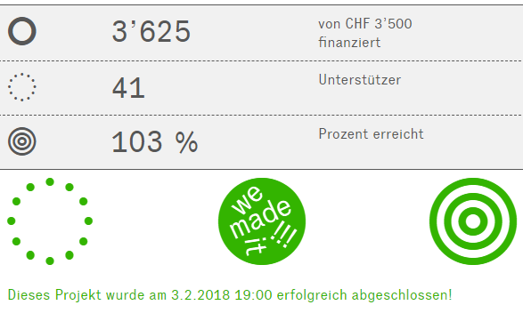

+++
title = "Crowdfunding 2018 auf wemakeit abgeschlossen"
date = "2018-02-20"
description = "Ende Dezember 2017 haben wir unser Projekt auf der Crowdfunding-Plattform WeMakeIt vorgestellt und suchten in den vergangenen 2 Monaten Unterstützer für die Ziele, die wir uns für das 2018 gesteckt hatten."
image = "crowdfunding-wemakeit.png"
author = "Philipp Meyer"
+++

Ende Dezember 2017 haben wir unser Projekt auf der Crowdfunding-Plattform [WeMakeIt](https://wemakeit.com/projects/nutzung-von-landmaissorten) vorgestellt und suchten in den vergangenen 2 Monaten Unterstützer für die Ziele, die wir uns für das 2018 gesteckt hatten. 

Wir sind sehr glücklich euch heute zu berichten, dass dank der grosszügigen Unterstützung von 43 Crowdfundern unser Projekt in die nächste Phase übergehen kann. 

Wir werden im 2018 eine eigene Siebmaschine entwickeln, die die gemahlenen Körner auftrennt in Maisgriess, Maismehl und Spreu. Zudem werden wir uns darauf fokussieren, die grüne Landmaissorte Oaxacan züchterisch zu verbessern. Dies um die mittelmässige Standfestigkeit und die Anfälligkeit auf Beulenbrand zu verbessern. 

Ein herzliches Dankeschön an alle Unterstützer für euer Vertrauen in unser Projekt!
