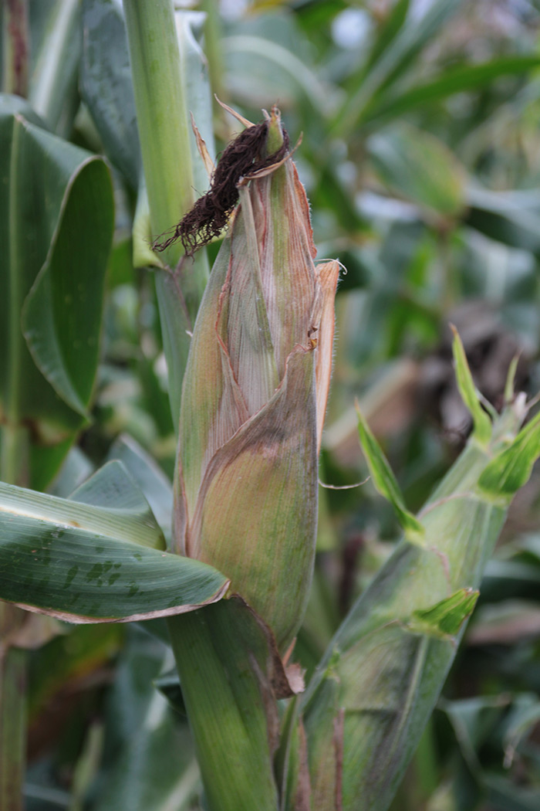
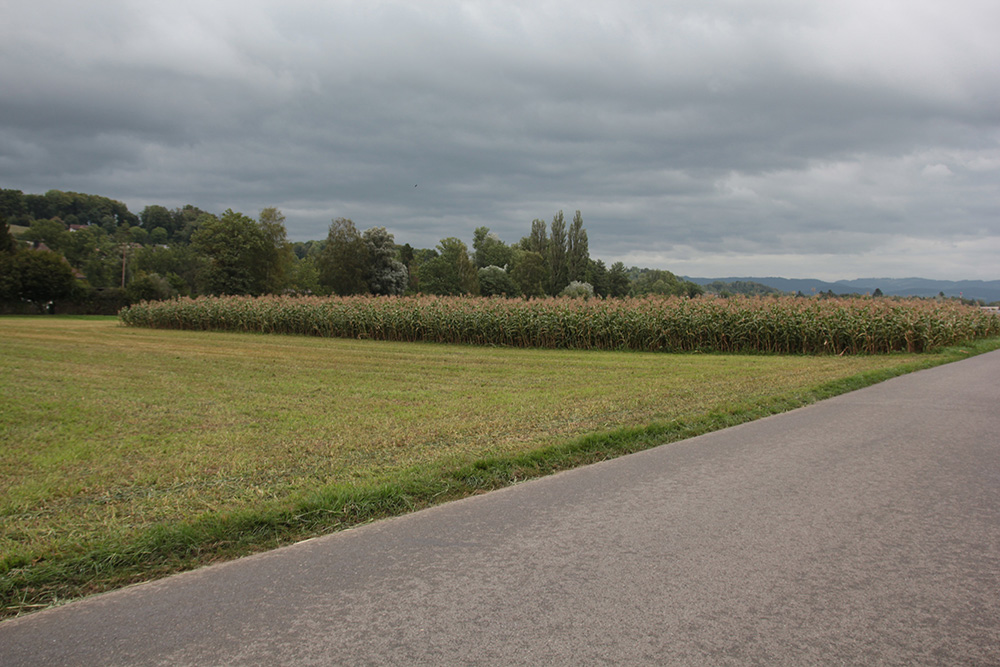
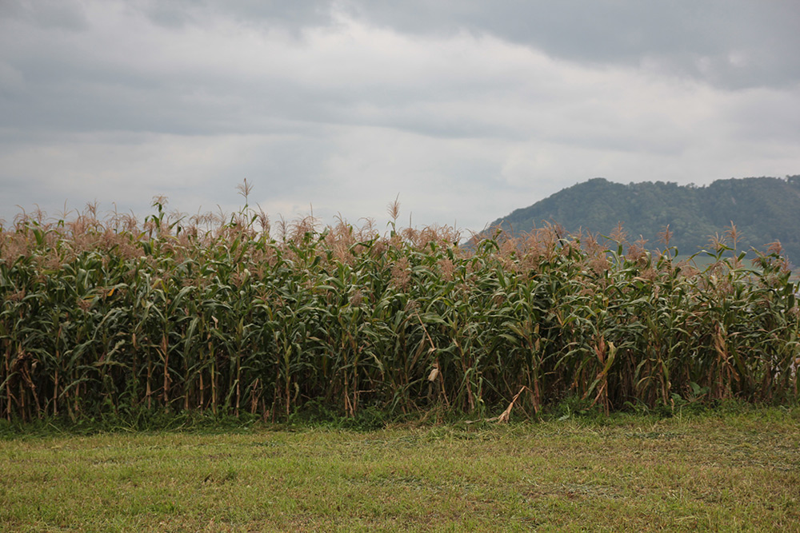

+++
title = "Kehrsatz: Abreife bereits eingesetzt"
date = "2017-09-09"
description = "Die Sorte Oaxacan Green ist bereits Anfang September am abreifen und erste Kolben sind bereits trocken. Bei einem Augenschein sind wir mit dem Anbau zufrieden."
image = "2-kolben.jpg"
author = "Philipp Meyer"
+++

Die Sorte Oaxacan Green ist bereits Anfang September am abreifen und erste Kolben sind bereits trocken. Bei einem Augenschein sind wir mit dem Anbau zufrieden.

Nun brauchen wir noch Geduld, bis wir die Ernte im Oktober dreschen können.

   
*Meist tragen die Pflanzen 2 schöne Kolben.*

   
*Das Feld in Kehrsatz von der Strasse aus.*

   
*In der Mitte des Bildes ist bereits ein trockener, nach unten hängender Kolben erkennbar.*
