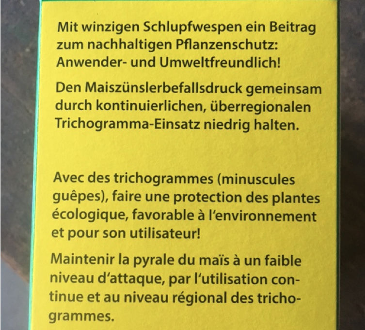

+++
title = "Kehrsatz: Bewässerung und Maiszünsler"
date = "2017-06-20"
description = "Da seit längerem kein Regen gefallen ist und die Temperaturen sehr hoch waren, ist der Boden langsam aber sicher so trocken, dass die Maispflanzen nur noch wenig Wasser aufnehmen können. Deshalb haben wir uns gemeinsam entschieden, die 20 Aren in Kehrsatz zu bewässern."
image = "bewaesserung.jpg"
author = "Philipp Meyer"
+++

   
*Die Bewässerung am 20. Juni am Abend im vollen Gang*

Da seit längerem kein Regen gefallen ist und die Temperaturen sehr hoch waren, ist der Boden langsam aber sicher so trocken, dass die Maispflanzen nur noch wenig Wasser aufnehmen können. Deshalb haben wir uns gemeinsam entschieden, die 20 Aren in Kehrsatz zu bewässern. Am 20. und 21. Juni wurde die Fläche mit 2x15 Liter Wasser je Quadratmeter bewässert. Da es sich um eine kleine Fläche handelt, war uns das möglich. Bei grösseren Flächen kann oft nur auf Regen gehofft werden. Nachteil der Bewässerung ist, dass sich Pilzkrankheiten vermehrt auf den Maispflanzen ausbreiten können.

   
*Ausgetrockneter Boden mit Rissen*

Im Mais kommt es je nach Region zu Befall mit einer Falterart, die Maiszünsler genannt wird. Die Larven fressen sich von oben nach unten durch den Stängel und überwintern danach im Boden. Dabei knicken die Maisstängel ein und auch der Kolben kann herunterfallen. Zudem werden die Maispflanzen im nächsten Jahr von den Larven gefressen.

Für letzteres Problem eignet sich als Bekämpfung die Einarbeitung des Maisstrohs im Herbst und eine Fruchtfolge - also nicht ständig Mais nach Mais. Für die Verhinderung von Ernteschäden kann eine spezielle Schlupfwespenart ausgesetzt werden, die spezifisch die Larven des Maiszünslers befällt. Am 20. Juni 2017 hat der Landwirt in Kehrsatz diese Trichogramma-Schlupfwespen im Maisfeld verteilt.

   
*Schlupfwespen sind auf einem Karton aufgeklebt und werden an einzelne Maispflanzen angebracht*

   
*Nur der regionale Einsatz von Schlupfwespen verspricht ausreichend Erfolg. Die Landwirte müssen sich idealerweise zusammentun.*
