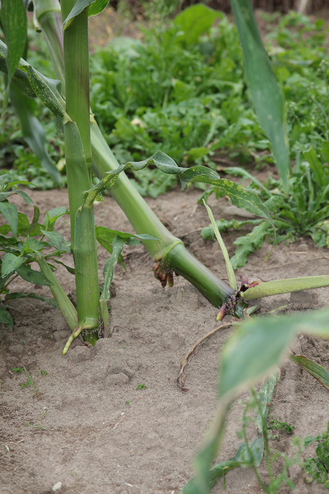

+++
title = "Kehrsatz: Blüte der grünen Landmaissorte"
date = "2017-07-15"
description = "Die Sorte Oaxacan Green, die wir in Kehrsatz anbauen, steht seit ca. Mitte Juli in der Blüte. Etwas, was uns Sorgen macht sind einige Pflanzen, die von einem Gewitter am 28. Juni zu Boden gedrückt wurden."
image = "umgefallen.jpg"
author = "Philipp Meyer"
+++

Die Sorte [Oaxacan Green](/maissorten/oaxacan-green/), die wir in Kehrsatz anbauen, steht seit ca. Mitte Juli in der Blüte. Etwas, was uns Sorgen macht sind einige Pflanzen, die von einem Gewitter am 28. Juni zu Boden gedrückt wurden. Mittlerweile haben sich diese Pflanzen grösstenteils wieder aufgerichtet. Wir hoffen, dass die kommenden Gewitter keine weiteren Pflanzen zu Boden drücken, damit der Mähdrescher dann auch gut durch die Reihen fahren kann.

