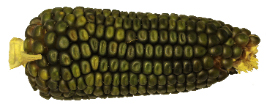

+++
title = "Saat 2017 in Kehrsatz"
date = "2017-05-05"
description = "An einem schönen Tag konnten 20 Aren der Sorte Oaxacan Green gesät werden. Die Saat wurde vom Lohnunternehmer ausgeführt, der mit der gleichen Maschine noch etwas Dünger unter die ausgesäten Körner in den Boden gibt."
image = "oaxacan-green.jpg"
author = "Philipp Meyer"
aliases = [
  "/blog/saat-2017-kehrsatz/"
]
+++

An einem schönen Tag konnten 20 Aren der Sorte Oaxacan Green gesät werden. Die Saat wurde vom Lohnunternehmer ausgeführt, der mit der gleichen Maschine noch etwas Dünger unter die ausgesäten Körner in den Boden gibt.
Nach dem Keimen konnten die Krähen mit Hilfe einer Schreckschusspistole erfolgreich daran gehindert werden, die nicht gebeizten Saatkörner aus dem Boden zu picken.
