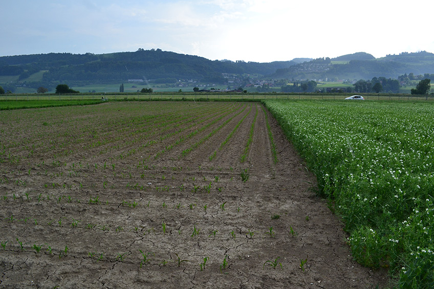
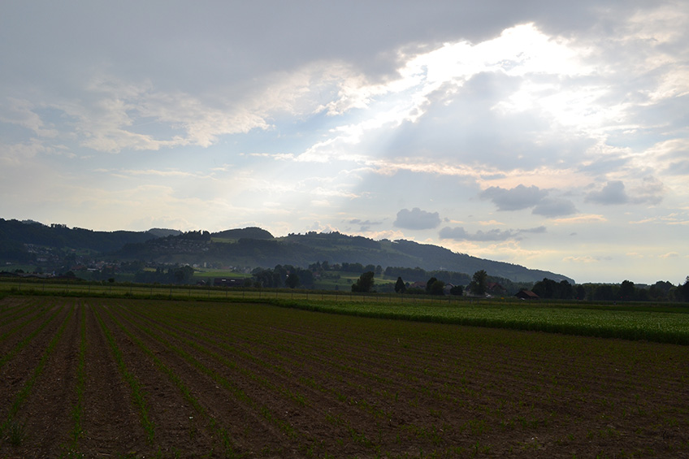
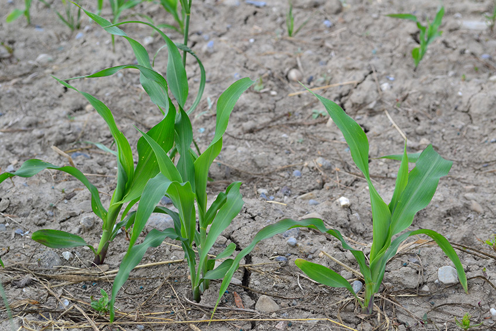

+++
title = "Kehrsatz: Vorlaufherbizid"
date = "2017-05-11"
description = "Die Saat und Pflege haben wir an den Landwirt in Kehrsatz abgegeben. Er hat sich dafür entschieden, das Unkraut mit einem Herbizid zu bekämpfen, das vor dem Auflaufen der Maispflanzen gespritzt wird."
image = "kehrsatz-1.jpg"
author = "Philipp Meyer"
+++

Die Saat und Pflege haben wir an den Landwirt in Kehrsatz abgegeben. Er hat sich dafür entschieden, das Unkraut mit einem Herbizid zu bekämpfen, das vor dem Auflaufen der Maispflanzen gespritzt wird. Dieses Mittel wird von den Unkräutern und Ungräsern über die Wurzeln und Blätter aufgenommen und hemmt die Zellteilung. Am 26. Mai wurden die übriggeblieben Winden und Quecken von Hand ausgerissen. Diese hartnäckigen Pflanzen werden über das eingesetzte Spritzmittel kaum erfasst.

