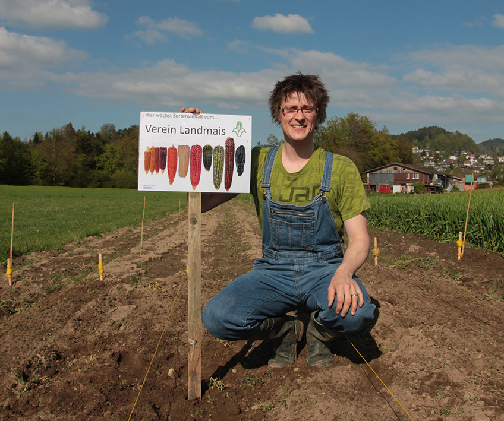
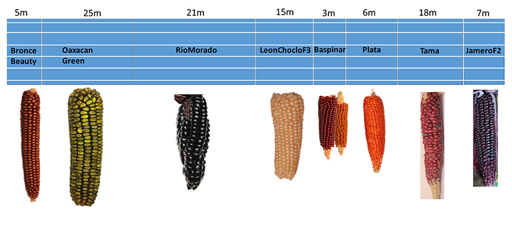
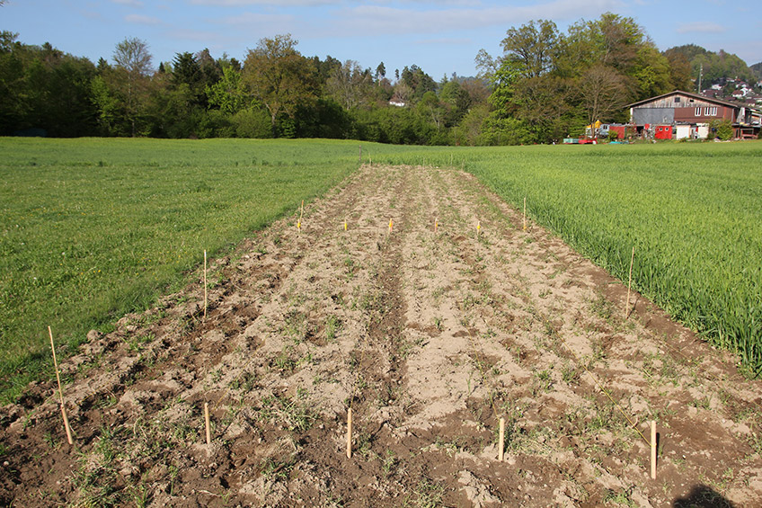
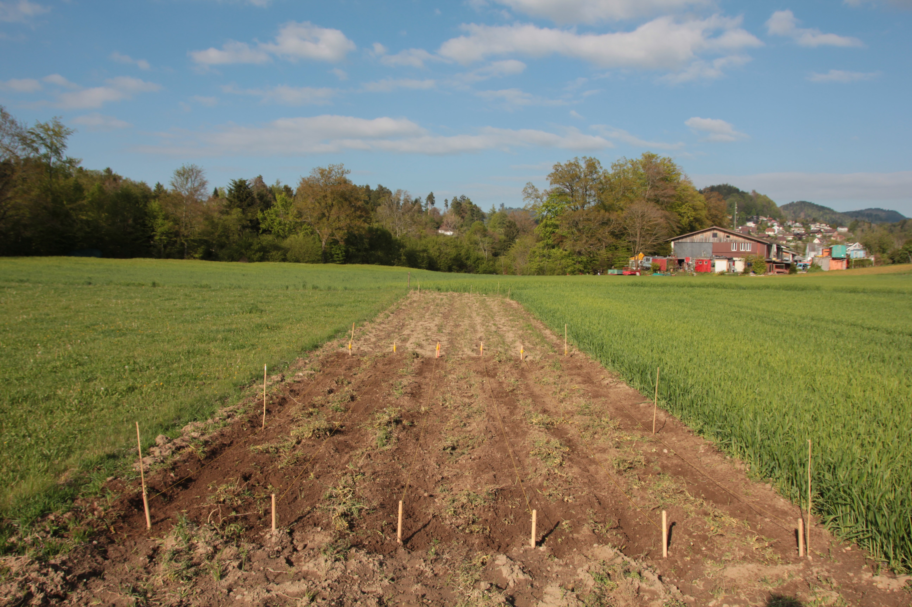
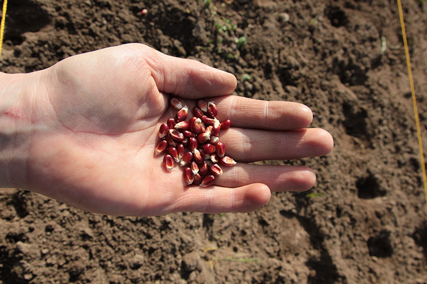
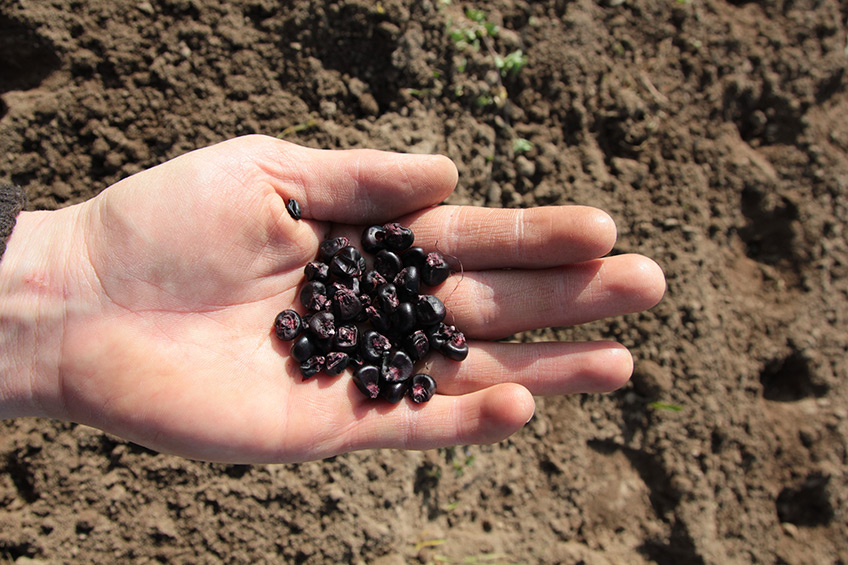
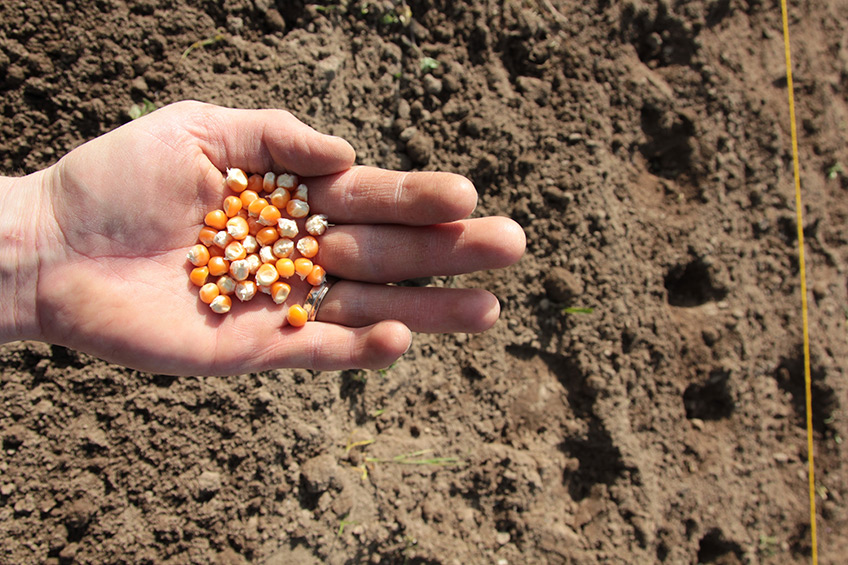
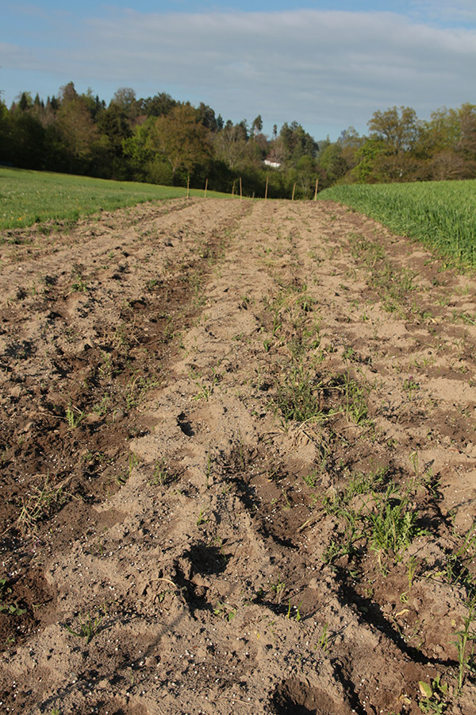

+++
title = "Saat 2017 in Scherli"
date = "2017-04-29"
description = "Ende April war das Wetter nicht an vielen Tagen schön. Deshalb sind wir froh, dass es kurz schön blieb für die Bodenbearbeitung und die Saat der meisten Sorten."
image = "philipp-meyer-saat.jpg"
author = "Philipp Meyer"
+++

Ende April war das Wetter nicht an vielen Tagen schön. Deshalb sind wir froh, dass es kurz schön blieb für die Bodenbearbeitung und die Saat der meisten Sorten.

   
Anbauplan für die Parzelle in Scherli

   
Ein Feld für eine Sorte wird abgesteckt (Zeilen mit 75cm Abstand)

   
Mit dem Rechen wird das verbleibende Unkraut weggerecht

   
Baspinar

   
Morado

   
Plata

   
Mit der Saat habe ich Dünger ausgebracht. Etwa einen Drittel der Menge, die ich über das ganze Jahr verteilt düngen muss (30N, 13P, 26K)
