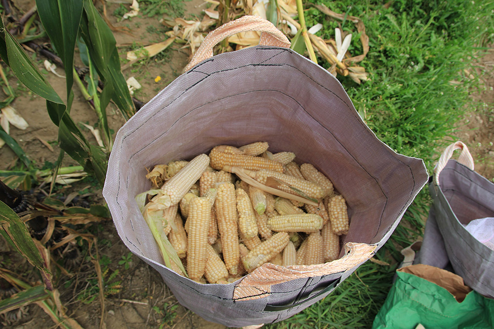

+++
title = "Scherli: Ernte hat begonnen"
date = "2017-09-30"
description = "Am 30. September wurde die erste der 8 Sorten in Scherli geerntet. Die Sorte LeonChoclo mit weissen Kolben war bereits gut reif und es konnten viele schöne Kolben geerntet werden."
image = "maisernte.jpg"
author = "Philipp Meyer"
+++

Am 30. September wurde die erste der 8 Sorten in Scherli geerntet. Die Sorte LeonChoclo mit weissen Kolben war bereits gut reif und es konnten viele schöne Kolben geerntet werden. Kolbenfäule sah ich selten und auch der Vogelfrass hielt sich im Vergleich zu den anderen Sorten in Grenzen.

Bis am 14. Oktober wird die Ernte aller Sorten abgeschlossen sein. Danach werden die Pflanzen noch „abgeschlegelt“. Erst im nächsten Frühling wird der Boden gepflügt und geeggt.

   
*Die bereits recht dürren Pflanze der weissen Landmaissorte.*

   
*Ein Teil der Ernte der rund 60 Quadratmetergrossen Parzelle.*

   
*Vogelfrass an den Kolben. Es müssen grössere Vogelarten eingeflogen sein (Eichelhäher?).*
