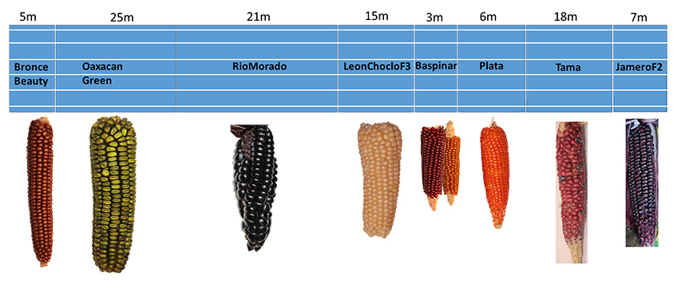

+++
title = "Scherli: Erstes Fazit zur Saat"
date = "2017-06-09"
description = "Ein erstes Fazit zur Saat in Scherli."
image = "anbauplan.jpg"
author = "Philipp Meyer"
+++

Ein erstes Fazit zur Saat in Scherli.

   

#### Bronce Beauty

nur etwa 20% Pflanzen wurden von den Raben verschont. Darum habe ich diese sehr frühe Sorte nachgesät. Nun stehen regelmässig Pflanzen auf 6 Zeilen.

#### Oaxacan Green

2 von 6 Zeilen sind von den Raben gefressen worden. Die restlichen 4 Zeilen enthalten viele Pflanzen.

#### Rio Morado

Auch hier fehlen 2 von 6 Zeilen. In die Lücken habe ich nachgesät. Nun stehen 4 schön gefüllte Zeilen.

#### LeonChoclo

Auch hier haben die Raben 2 von 6 Reihen rausgepickt. Diese Sorte habe ich deshalb ebenfalls nachgesät, um die Lücken zu füllen. Nun stehen 5 Zeilen.

#### Baspinar

Diese Sorte ist schlecht aufgelaufen und die Raben haben den Rest fast komplett gefressen. Eine Nachsaat habe ich nicht gemacht.

#### Plata

Von dieser Sorte stehen nur noch auf 2 Zeilen Pflanzen. Der Rest wurde von den Raben gefressen.

#### Tama

Auf dieser Parzelle haben die Raben sehr grossen Schaden gemacht.  Nur noch etwa 10% der Pflanzen standen da. Nach der Nachsaat stehen nun 6 schöne Zeilen.

#### Jamero

Auf dieser Parzelle am Ende des Feldes hatte es sehr viel Quecken, was die Raben offenbar am aufpicken gehindert hat. So stehen doch etwa 60% der ursprünglich gesäten Körner.
