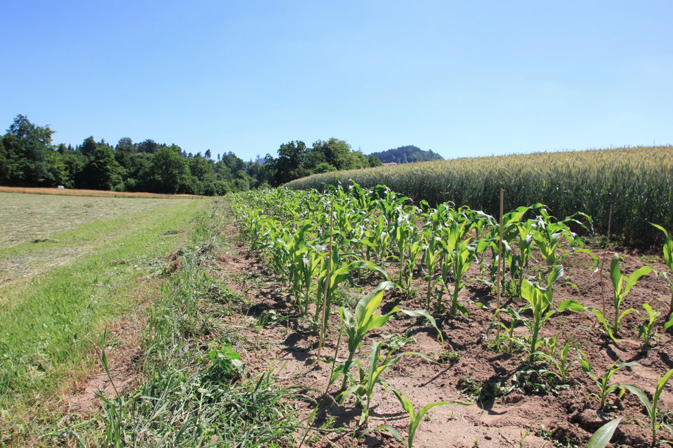
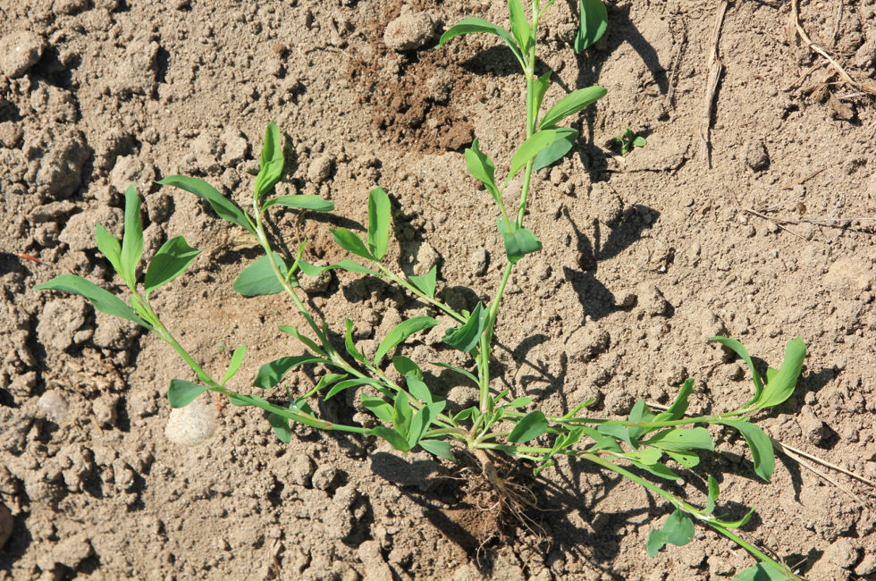
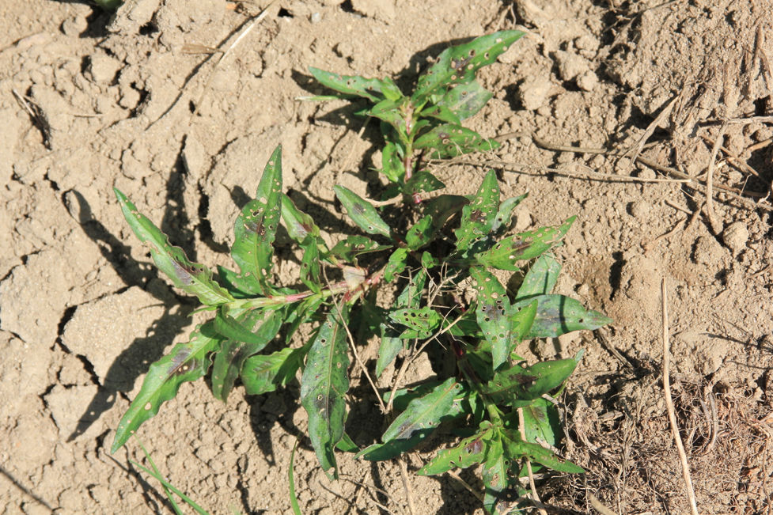

+++
title = "Scherli: Hacken"
date = "2017-06-16"
description = "Im Verlauf des Juni ging ich bereits das letzte Mal im grossen Stil gegen Unkräuter und Ungräser vor. Beim Jäten werden vor allem Unkräuter um die Maispflanzen herum entfernt, da der Mais im aktuellen Stadium besonders empfindlich gegen Unkrautdruck ist."
image = "nach-hacken.jpg"
author = "Philipp Meyer"
+++

   
*Maisparzelle nach dem Hacken*

Im Verlauf des Juni ging ich bereits das letzte Mal im grossen Stil gegen Unkräuter und Ungräser vor. Beim Jäten werden vor allem Unkräuter um die Maispflanzen herum entfernt, da der Mais ca. im 5-Blatt-Stadium (5 Blätter sind voll entwickelt) besonders empfindlich gegen Unkrautdruck ist und mit Minderertrag reagiert. Nun etwas später habe ich mit einer Hacke die Erde zwischen den Reihen zu den Maisreihen befördert. Damit werden die Maispflanzen «angehäufelt», was deren Standfestigkeit verbessert und die kleinen, neu gekeimten Unkräuter zudeckt.

Bei dieser Gelegenheit streue ich nochmals Dünger zu den Pflanzen und zwar nochmals gleichviel wie kurz nach der Saat (umgerechnet 30kg Stickstoff, 13kg Phosphor, 26kg Kali pro Hektare also pro 10’000 Quadratmeter).

   
*Vogelknöterich - jetzt häufig anzutreffen*

   
*Pfirsichblättriger Knöterich - jetzt häufig anzutreffen*
