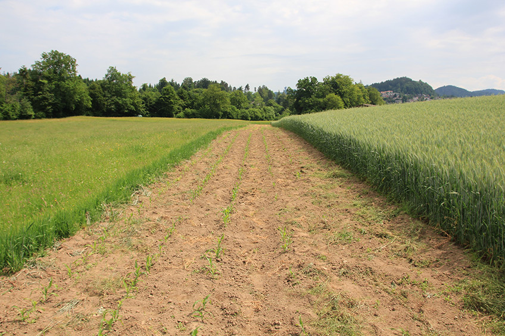

+++
title = "Scherli: Jäten"
date = "2017-05-29"
description = "In etwa 7 Stunden Arbeit habe ich die 500 Quadratmeter grosse Parzelle von Hand gejätet."
image = "nach-dem-jaeten.jpg"
author = "Philipp Meyer"
+++

In etwa 7 Stunden Arbeit habe ich die 500 Quadratmeter grosse Parzelle von Hand gejätet. Das wunderschöne, warme Wetter war ideal, um die Ungräser und Unkräuter auszureissen und auf dem Boden vertrocknen zu lassen.

   
*Scherli vor dem Jäten.*

   
*Scherli nach dem Jäten.*

   
*Quecke: diese vermehrt sich vor allem über die weissen Wurzelausläufer, weshalb sie weniger auf Ackerböden vorkommt, die gepflügt werden. Auf der Parzelle in Niederscherli gab es trotzdem einige Quecken zu jäten, da die Parzelle an eine mehrjährige Weide angrenzt.*

   
*Melde: dieses Unkraut läuft nach der Maissaat auf und wird mit dem Mais gross. Sie darf nie absamen, sonst keimen in den nächsten Jahren tausende neue Pflanzen. Übrigens: sie ist verwandt mit der Quinoa und sieht dieser im Jungendstadium sehr ähnlich.*

   
*Hirtentäschel: dieses Unkraut kommt in Wiesen relativ häufig vor und bedeckte in Niederscherli vor der Saat den grössten Teil des Bodens. Es ist relativ einfach auszureissen.*
