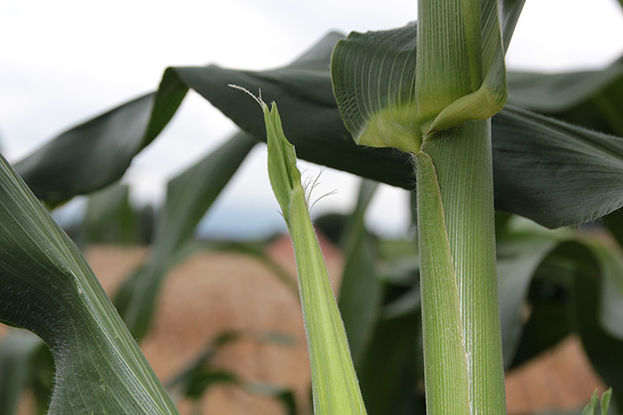
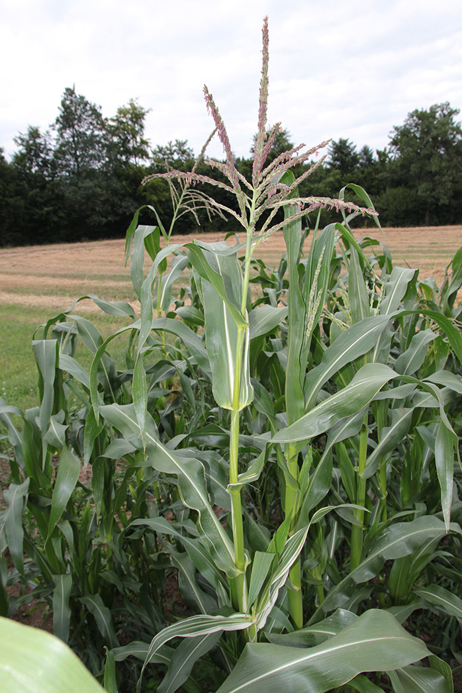
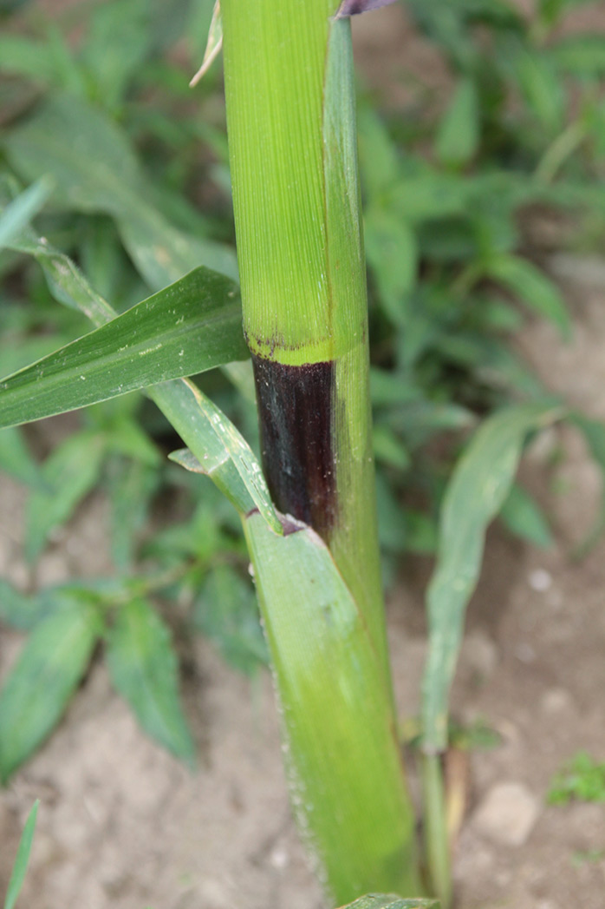
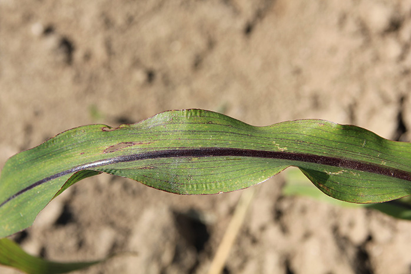
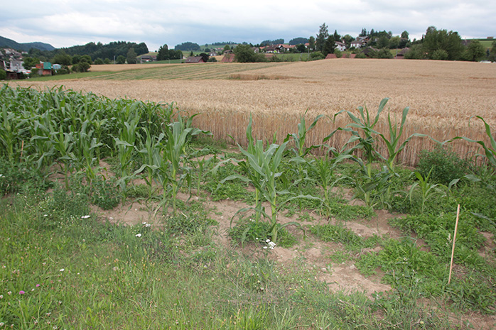

+++
title = "Scherli: Kontrollierte Bestäubung der Maissorten"
date = "2017-07-19"
description = "Das Wachstum der Maispflanzen ist nun bereits weit fortgeschritten. Die meisten Sorten stehen voll in der Blüte. Es gilt zu verhindern, dass der Wind eine zufällige Bestäubung durchführt und es zu Kreuzungen verschiedener Sorten kommt."
image = "seide.jpg"
author = "Philipp Meyer"
+++

Das Wachstum der Maispflanzen ist nun bereits weit fortgeschritten. Die meisten Sorten stehen voll in der Blüte. Dies ist eine intensive Zeit, wenn Maissorten erhalten werden sollen. Es gilt zu verhindern, dass der Wind eine zufällige Bestäubung durchführt und es zu Kreuzungen verschiedener Sorten kommt. Auch sollen schwache Pflanzen ausselektiert werden.

Möglichst jeden Morgen gehe ich deshalb aufs Feld und bestäube ausgewählte Maispflanzen mit anderen Pflanzen der gleichen Sorte. Zu diesem Zweck bedecke ich die Kolbenansätze mit einem Papiersack, kurz bevor die Seide an der Pflanze erscheint. Einen oder zwei Tage später ist die Seide da und so bringe ich Pollen anderer Pflanzen an die Seide und bedecke den Kolben wieder mit dem Papiersack und notiere das Datum der Bestäubung.

Bei Regen muss die Arbeit warten, denn die Bestäubung klappt nicht, wenn der Pollen mit Wasser in Berührung kommt.

   
*Seide = weibliche Blüte. Jeder Seidenfaden wird ein Korn befruchten*

   
*Fahne = männliche Blüte. In den farbigen Antheren wird der Pollen gebildet, der dann durch den Wind verteilt wird. Um die Selbstbefruchtung zu erschweren, blüht bei vielen Maissorten zuerst die Fahne und erst danach erscheint die Seide. Ich habe auch Sorten beobachtet, wo zuerst die Seide erscheint oder beide zusammen.*

   
*Sortenmerkmal der Moradosorten am Stängel. Die Stängel, Blattöhrchen, Blattadern sind dunkelviolett. Körner werden dunkelviolett bis schwarz gefärbt sein.*

   
*Sortenmerkmal der Moradosorten am Blatt. Die Stängel, Blattöhrchen, Blattadern sind dunkelviolett. Körner werden dunkelviolett bis schwarz gefärbt sein.*

   
*Rabenschaden: Von den Sorten Baspinar und Plata blieben nur noch wenig Pflanzen übrig.*
