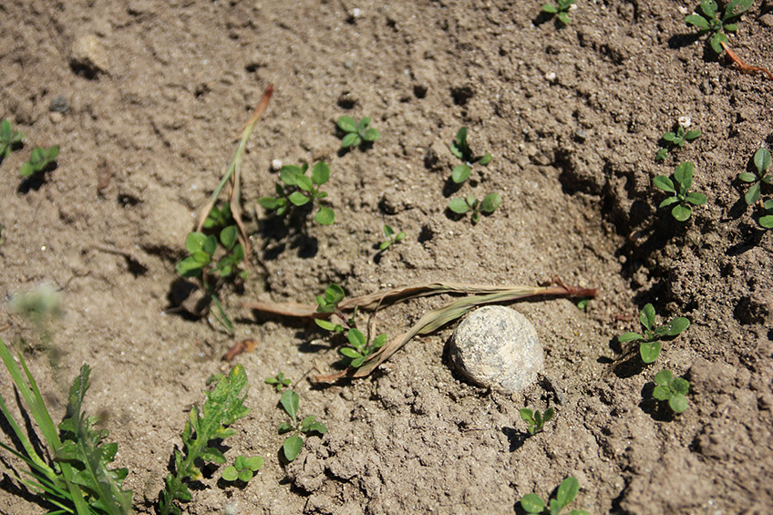
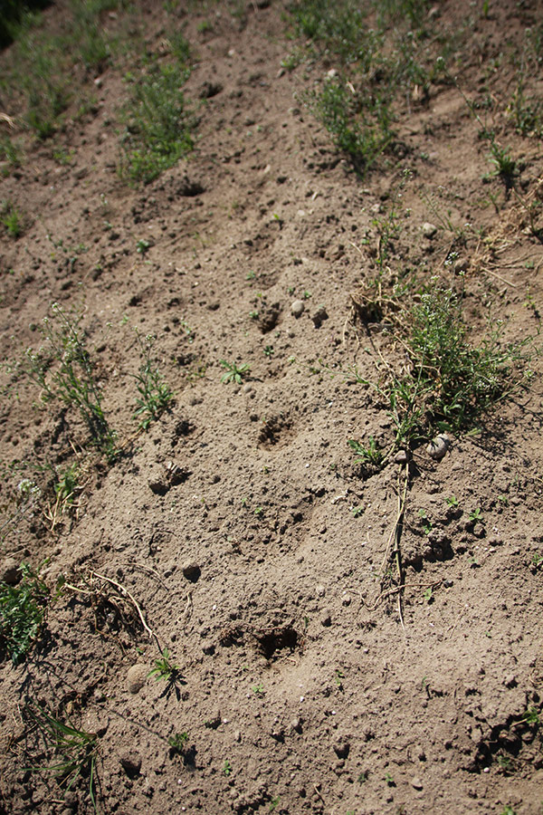

+++
title = "Scherli: Rabenschaden auf 50% der Fläche"
date = "2017-05-24"
description = "Der Schock war gross, als ich heute das Auflaufen der Saat kontrollierte. 2 von 6 Zeilen wurden von den Raben komplett rausgepickt."
image = "kraehenschaden-1.jpg"
author = "Philipp Meyer"
+++

Der Schock war gross, als ich heute das Auflaufen der Saat kontrollierte. 2 von 6 Zeilen wurden von den Raben komplett rausgepickt. Dazu gibt es Sorten, wo kaum 10% der gesäten Pflanzen stehen. Die Raben sind den Zeilen nachgegangen und haben die kleinen Maispflanzen oder schon die noch nicht gekeimten Körner rausgepickt.

   
*Krähenschaden. Die aufgelaufenen Pflanzen wurden rausgerissen und das Korn gefressen.*

## Nachsaat von 4 Sorten

Um den Schaden in Grenzen zu halten, habe ich mich entschieden, bei 4 Sorten eine Nachsaat zu machen. Nach 3 Stunden Feldarbeit ist alles im Boden und ich hoffe, es kommt diesmal besser. Um es den Raben möglichst schwierig zu machen, habe ich das Saatgut über Nachtn in Wasser eingelegt, um ein schnelles Keimen zu fördern. Zudem habe ich die ausgerissenen Unkräuter auf die neu gesäten Lücken gelegt, damit die Raben die neuen Pflänzchen nicht sofort sehen.

## Nachteil der Nachsaat

Da Mais hauptsächlich ein Fremdbefruchter ist, braucht eine Pflanze auch den Pollen anderer Pflanzen. Blühen nun andere Sorten 10 Meter daneben, wird es für mich schwieriger, Einkreuzungen in einer Sorte zu verhindern.

   
*Erkennbar sind die Löcher, die die Raben hinterlassen, nachdem sie die kleinen Maispflanzen oder die Körner rausgepickt haben.*
