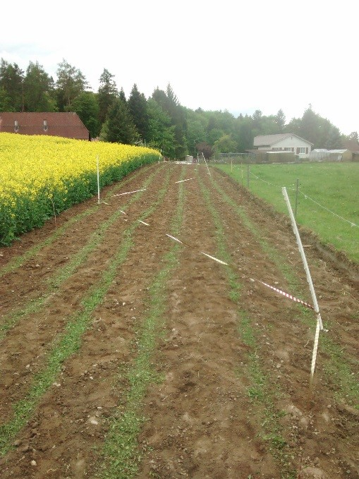

+++
title = "Scherli: Alle Sorten gesät"
date = "2018-04-28"
description = "Ende April, kurz vor dem Regen, konnten wir alle Sorten in Scherli säen."
image = "saat.jpg"
author = "Philipp Meyer"
+++

Ende April, kurz vor dem Regen, konnten wir alle Sorten in Scherli säen. Dies waren die Sorten: 

-	[Oaxacan](/maissorten/oaxacan-green/): grüne Zahnmaissorte
-	[Tama](/maissorten/tama/): 				lila Hartmaissorte
-	Punz:				weisse Zahnmaissorte
-	[Oranger Tessinermais](/maissorten/oranger-tessinermais/):	orange-rote Hartmaissorte
-	[Jamero](/maissorten/jamero/):			violette Hartmaissorte
-	[Plata](/maissorten/plata/):				orange Hartmaissorte
-	[Rio Morado](/maissorten/rio-morado/):			schwarze Weichmaissorte (für Tortillamehl)
-	[Rio Lucio](/maissorten/rio-lucio/):			blaue Weichmaissorte (für Tortillamehl)

## Ablenkung der Raben

Nun müssen die Raben abgelenkt werden. Wir versuchen dies aktuell mit dem Ausbringen einer dünnen Schicht Rasenschnitt, damit die aufkeimenden Maispflanzen für die Raben schwerer zu finden sind (siehe Bild). Zudem haben wir ein glänzendes Folienband über das Feld gespannt, in dem sich das Sonnenlicht spiegelt. Später werden wir versuchen, ein Gerät einzusetzen, das Raubvögel imitiert. 
