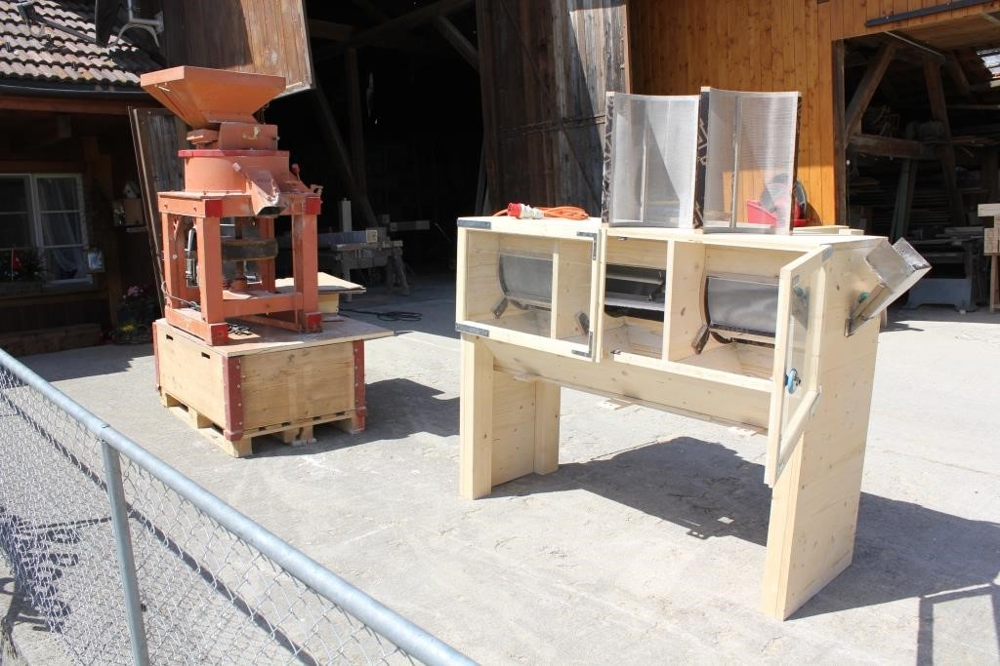
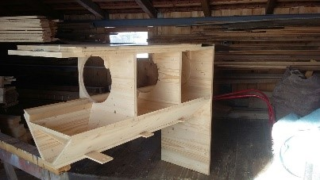
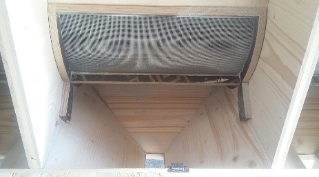
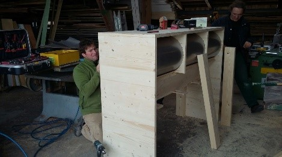
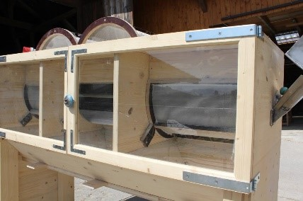
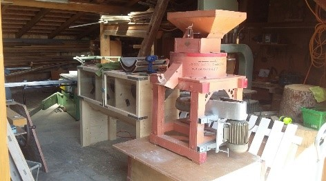

+++
title = "Siebmaschine ist gebaut"
date = "2018-04-24"
description = "Mit dem Crowdfunding haben wir Unterstützer gesucht, damit wir für die Verarbeitung unserer Ernte eine eigene Siebmaschine bauen können. Von Winter bis Frühling hat sich nun Roger ans Werk gemacht und aus Holz einen Kasten konstruiert, Siebe eingebaut und einen Motor zum Laufen gebracht."
image = "siebmaschine-5.jpg"
author = "Philipp Meyer"
+++

Mit dem [Crowdfunding auf wemakeit](https://wemakeit.com/projects/nutzung-von-landmaissorten) haben wir Unterstützer gesucht, damit wir für die Verarbeitung unserer Ernte eine eigene Siebmaschine bauen können. Von Winter bis Frühling hat sich nun Roger ans Werk gemacht und aus Holz einen Kasten konstruiert, Siebe eingebaut und einen Motor zum Laufen gebracht.

## Und so funktioniert's

die gemahlenen Körner kommen nach der Mühle direkt in die Siebmaschine. In der Maschine drehen kleine Besen, die das Mahlgut an den verschiedenen Sieben vorbeibringen. Dort trennt sich zuerst das Mehl ab, dann das Griess, bevor hinten die Spreu wieder rausfällt. 

Nun arbeiten wir noch an Feinjustierungen. 

Für unsere Crowdfunder organisieren wir am 3. November 2018 eine Maschinenvorführung mit kleinem Apéro. Bitte merkt euch den Termin. Nähere Infos folgen. 

## Video

	<iframe src="//player.vimeo.com/video/267677940"></iframe>

## Weitere Bilder

