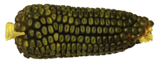

+++
title = "Start mit Blog"
date = "2017-04-28"
description = "Der Verein Landmais hat im 2016 ein Projekt lanciert, das zum Ziel hat, mehrere Landmaissorten zu erhalten und eine davon bei einem Landwirt in Kehrsatz auf 20 Aren anzubauen. Wir sind der Meinung: Über ein gut verkauftes Produkt kann eine Sorte nachhaltig erhalten werden."
image = "oaxacan-green-querschnitt.jpg"
author = "Philipp Meyer"
+++

Der Verein Landmais hat im 2016 ein Projekt lanciert, das zum Ziel hat, mehrere Landmaissorten zu erhalten und eine davon bei einem Landwirt in Kehrsatz auf 20 Aren anzubauen. Wir sind der Meinung: Über ein gut verkauftes Produkt kann eine Sorte nachhaltig erhalten werden. Deshalb sind wir froh, dass wir mit der Unterstützung von [Crowdfundern](/crowdfunding/) im Mai 2017 endlich die Sorte Oaxacan Green säen konnten.

### Kurzer Steckbrief der angebauten Sorte

**Oaxacan Green**

* Eine wüchsige, robuste und frühreife Sorte
* Reifeklasse*: mittelfrüh (≈1550 C° Gradtage)
* Morphologie*: 250cm hoch, 1.83cm Stängeldurchmesser, 1.91 Kolben mit meist 12-14 Körnerreihen
* Spezielle Merkmale: leicht bestockend
* Herkunft: Region Oaxacan in Mexiko. Jahrhundertealter Anbau durch dort ansässige Zapoteken-Indianer wird vermutet.
* Ertrag: hohes Ertragspotenzial
* Verwendung: Polenta Griess, Mehl, Zutat zum Backen

\*die Angaben stammen aus einer Erhebung im 2013 durch mich selber.

## Über diesen Blog

Um unsere Unterstützer über den Verlauf des Anbaus auf dem Laufenden zu halten, haben wir einen kleinen Blog eingerichtet. Wir werden von Zeit zu Zeit aktuelle Fotos vom Anbau in Kehrsatz und Scherli mit kurzen Kommentaren von mir online stellen.
